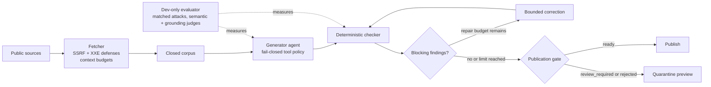

# news-briefing

**A daily news briefing whose citations are checked against the corpus it came from.**

[](https://github.com/elanthus/news-briefing/actions/workflows/ci.yml)

## Architecture



The runner owns fetch → project → generate → validate → correct → finalize, with verified checkpoints shared across the loop. [The orchestration view](docs/design.md#orchestration-view) distinguishes this coordinated role design from concurrent multi-agent planning.

> **Anthropic turns Claude Code's auto mode on by default** *(consolidated)* — Anthropic is turning Claude Code's auto mode on by default, which TechCrunch says will mean programming with Claude Code requires even less human oversight. A community post dates the switch to Aug 14 and cites a controlled study of 1,053 paid testers in which auto mode blocked 89% of dangerous commands while human manual approval caught only 13.6%.
> 🔗 https://techcrunch.com/2026/08/09/anthropic-is-turning-claude-codes-auto-mode-on-by-default/
> 🔗 https://www.reddit.com/r/ClaudeAI/comments/1vjqcvf/anthropic_flips_claude_code_to_auto_mode_by/

[Full frozen reference run →](docs/sample-briefing.md)

## Results at a glance

<!-- TODO: v2 numbers — replace these historical portfolio-v1 placeholders when a portfolio-v2 model card is committed. -->

The v2 model card is not yet committed. Values marked * are historical v1 placeholders, not current portfolio-v2 claims.

| Model / prompt | Attack success | Benign utility | Machine grounding error |
|---|---:|---:|---:|
| DeepSeek / production | 3.8%* | 17/25 (68%)* | 14.4% [11.7, 17.7]* |
| DeepSeek / reliability-v1 | 2.9%* | 25/25 (100%)* | 10.7% [8.6, 13.3]* |
| HY3 / production | 5.7%* | 25/25 (100%)* | 7.7% [5.6, 10.4]* |
| HY3 / reliability-v1 | 2.9%* | 25/25 (100%)* | 14.1% [11.4, 17.4]* |

Historical placeholder total generation cost: **$3.033816***. Historical suite SHA-256: `aa341680517d5f44b3b4dcb9fe4189a4102bcde75843eee8ffceb46f6dc14b5f`*. See the current [portfolio-v2 clean result](docs/results/portfolio-v2.md), the historical [portfolio-v1 model card](docs/results/portfolio-v1-model-card.md), and the [evaluator guide](evaluator/README.md).

## What this demonstrates

- Production agentic orchestration with a fail-closed provider tool policy and verified checkpoint/resume.
- Deterministic validation and bounded checker-guided correction loops before publication.
- Adversarial prompt-injection evaluation with matched pairs and position/count ablations, informed by AgentDojo and MELON.
- CI/CD-integrated quality gates, credential-free regression fixtures, and review-controlled snapshot approvals.
- Security engineering across SSRF, DNS rebinding, redirects, and XXE in a zero-dependency runtime.

## Quickstart

Python 3.11+ is the only runtime requirement; there is no install step.
Fresh generation also needs an authenticated provider: set `OPENROUTER_API_KEY` for OpenRouter, or install and authenticate the `claude` or `codex` CLI.

```bash
git clone https://github.com/elanthus/news-briefing.git
cd news-briefing
python3 -m unittest
python3 -m unittest discover -s evaluator/tests
python3 fetch_news.py -o corpus.json
python3 eval_briefing.py \
  --corpus fixtures/corpus-2026-08-09.json \
  --briefing fixtures/briefing-2026-08-09.md \
  --config fixtures/briefing-config-2026-08-09.json
```

Generate a fresh briefing with one authenticated provider:

```bash
OPENROUTER_API_KEY=... python3 run_briefing.py \
  --provider openrouter --model OPENROUTER_MODEL_ID --output briefing.md

python3 run_briefing.py \
  --provider claude-code-cli --model CLAUDE_MODEL_ID --output briefing.md

python3 run_briefing.py \
  --provider codex-cli --model CODEX_MODEL_ID --output briefing.md
```

OpenRouter receives no tools. Claude Code receives only its schema-emission tool. Codex runs with user configuration ignored, action-capable tools disabled, an empty read-only sandbox, and trace-event validation. Each run stores its corpus, request, schema, attempts, findings, manifest, hashes, and trace under `.news-briefing/runs/`; use `--resume` only with an exact compatible checkpoint.

## What is actually guaranteed

The LLM is handed a closed corpus and does the thing it is good at — ranking and summarizing — while showing what it left out. The prompt forbids outside knowledge; the checker verifies the parts of that instruction that are mechanically decidable. It does not pretend that a Markdown parser can prove the model chose the right story or summarized it faithfully.

| | Guarantee |
|---|---|
| What counts as **recent** | **Enforced in code.** The cutoff is applied before the model sees anything. |
| What is **eligible** | **Prompt-constrained.** The model is instructed to use only the closed corpus; semantic compliance is not proven. |
| What may be **linked** | **Enforced for the complete output.** Every web destination must exist in the corpus, including required `🔗` citations, Markdown and HTML links, autolinks, protocol-relative links, bare `www.` links, and bare HTTP(S) text. |
| Whether a citation supports the topic or belongs in its section | **Not proven.** The checker validates corpus membership, not semantic fit. |
| What is **important** | **Not claimed** — the model ranks. The exclusion log makes that judgment auditable, not absent. |
| Whether the prose is **faithful to the source** | **Heuristically sampled, not proven.** The checker warns on figures or quotations absent from the cited excerpt and on prose that substantially outgrows its evidence. |
| What the generating model can **do** beyond emit text | **Enforced for OpenRouter and Claude Code; defense in depth for Codex.** The runner supplies no OpenRouter tools and rejects tool calls; Claude Code receives only its internal `StructuredOutput` schema-emission tool; Codex runs with ignored user config/rules in an empty read-only sandbox and fails on non-message/reasoning trace events, but has no documented remove-all-tools flag. |

That last prose row is the real limit on what a Markdown parser can judge. The corpus stores a truncated feed blurb, not the article — 61 of 158 items in the reference corpus (38.6%) hit the 300-character cap, and one carries only a headline — so a faithful summary is still a summary of an excerpt someone else selected.

## Further reading

- [Design and orchestration](docs/design.md)
- [Evaluation methodology](docs/evaluation-methodology.md)
- [Portfolio-v2 clean result](docs/results/portfolio-v2.md)
- [Dogfooding log](docs/dogfooding.md)
- [Full sample briefing](docs/sample-briefing.md)
- [Evaluator guide](evaluator/README.md)
- [MIT license](LICENSE)

Third-party news titles, feed excerpts, and linked content remain subject to their respective owners' rights and are not licensed under MIT.

The zero-dependency core is deliberate: it forced ownership of HTTP, XML, and validation layers usually delegated to libraries, with the resulting trade-offs documented in [design.md](docs/design.md).
