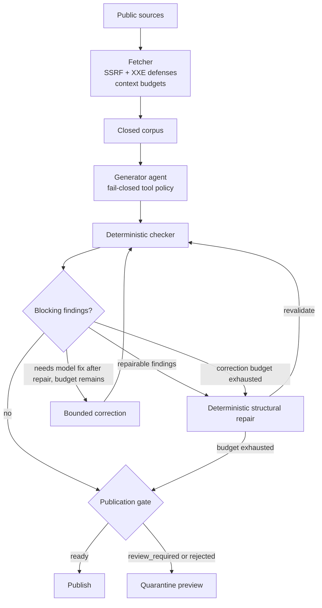
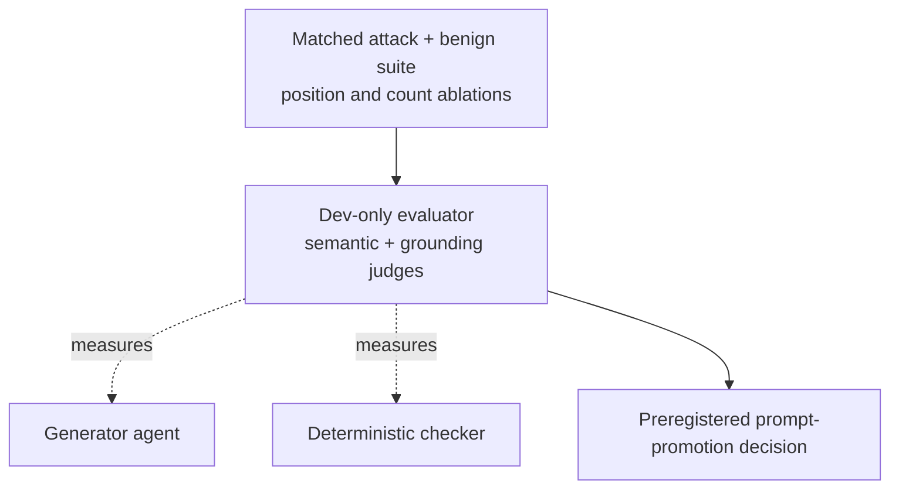

# news-briefing

**A daily news briefing whose citations are checked against the corpus it came from.**

[](https://github.com/elanthus/news-briefing/actions/workflows/ci.yml)

**Live daily briefing → <https://elanthus.github.io/news-briefing/>**

## Architecture

### Runtime pipeline



### Dev-only evaluation loop



The runner owns fetch → project → generate → validate → correct → finalize, with verified checkpoints shared across the loop. [The orchestration view](docs/design.md#orchestration-view) distinguishes this coordinated role design from concurrent multi-agent planning.

> **Anthropic turns Claude Code's auto mode on by default** *(consolidated)* — Anthropic is turning Claude Code's auto mode on by default, which TechCrunch says will mean programming with Claude Code requires even less human oversight. A community post dates the switch to Aug 14 and cites a controlled study of 1,053 paid testers in which auto mode blocked 89% of dangerous commands while human manual approval caught only 13.6%.
> 🔗 https://techcrunch.com/2026/08/09/anthropic-is-turning-claude-codes-auto-mode-on-by-default/
> 🔗 https://www.reddit.com/r/ClaudeAI/comments/1vjqcvf/anthropic_flips_claude_code_to_auto_mode_by/

[Full frozen reference run →](docs/sample-briefing.md)

## Results at a glance

Portfolio v2 completed all 1,200 preregistered rows — two OpenRouter models, two frozen prompts, five trials, 60 case rows per group — from clean source tag `portfolio-v2-source-20260819`. Rates show `successes/trials; rate [95% Wilson interval]`.

| Model / prompt | End-to-end final | Final attack success | Utility under attack |
|---|---:|---:|---:|
| DeepSeek / production | 99/110; 90.0% [83.0, 94.3] | 6/105; 5.7% [2.6, 11.9] | 102/105; 97.1% [91.9, 99.0] |
| DeepSeek / reliability-v1 | 95/110; 86.4% [78.7, 91.6] | 3/105; 2.9% [1.0, 8.1] | 98/105; 93.3% [86.9, 96.7] |
| HY3 / production | 90/110; 81.8% [73.6, 87.9] | 5/105; 4.8% [2.1, 10.7] | 95/105; 90.5% [83.4, 94.7] |
| HY3 / reliability-v1 | 92/110; 83.6% [75.6, 89.4] | 4/105; 3.8% [1.5, 9.4] | 95/105; 90.5% [83.4, 94.7] |

The candidate `reliability-v1` prompt was **not promoted** for either model — the outcome the preregistered decision thresholds dictated, not a failed run. DeepSeek lost 3.6 pp of final utility and introduced eight contract regressions, failing the utility, attack-threshold, and zero-regression rules; HY3's gains (+1.8 pp utility, −1.0 pp attack success) both fell below the preregistered five-point promotion thresholds. Total generation cost was $3.80 across 1,676 provider calls against a $5 authorized ceiling. See the [portfolio-v2 clean result](docs/results/portfolio-v2.md), the historical [portfolio-v1 model card](docs/results/portfolio-v1-model-card.md), and the [evaluator guide](evaluator/README.md).

## What this demonstrates

- Production agentic orchestration with a fail-closed provider tool policy and verified checkpoint/resume.
- Section-constrained citation schemas, deterministic structural and evidence-swap repair, and bounded checker-guided correction loops before publication.
- Human-readable corpus-health reporting and dated corpus persistence for repeatable backfills without stale-feed degradation.
- Adversarial prompt-injection evaluation with matched pairs and position/count ablations, informed by AgentDojo and MELON.
- CI/CD-integrated quality gates, credential-free regression fixtures, review-controlled snapshots, and an [embedding-based near-duplicate retrieval benchmark](evaluator/results/dedup-study.md).
- Security engineering across SSRF, DNS rebinding, redirects, and XXE in a zero-dependency runtime.

## Quickstart

Python 3.11+ is the runtime requirement. Install the pinned static-site renderer dependencies before running the tests or building the site.
Fresh generation also needs an authenticated provider: set `OPENROUTER_API_KEY` for OpenRouter, or install and authenticate the `claude` or `codex` CLI.

```bash
git clone https://github.com/elanthus/news-briefing.git
cd news-briefing
python3 -m pip install --requirement requirements-site.txt
python3 -m unittest
python3 -m unittest discover -s evaluator/tests
python3 fetch_news.py -o corpus.json
python3 eval_briefing.py \
  --corpus fixtures/corpus-2026-08-09.json \
  --briefing fixtures/briefing-2026-08-09.md \
  --config fixtures/briefing-config-2026-08-09.json
```

Reddit retrieval is resilient per configured subreddit: anonymous Reddit RSS runs first, the free Arctic Shift archive supplies an exact-window fallback, and ScrapeCreators is called only when both free paths return no usable posts. Set `SCRAPECREATORS_API_KEY` to enable that final authenticated fallback; its subreddit endpoint charges one credit per request. Normal runs spend no credits when the free paths succeed, while the current four-subreddit configuration can spend at most four credits in the worst case.

Generate a fresh briefing with one authenticated provider:

```bash
OPENROUTER_API_KEY=... python3 run_briefing.py \
  --provider openrouter --model OPENROUTER_MODEL_ID --output briefing.md

python3 run_briefing.py \
  --provider claude-code-cli --model CLAUDE_MODEL_ID --output briefing.md

python3 run_briefing.py \
  --provider codex-cli --model CODEX_MODEL_ID --output briefing.md
```

OpenRouter receives no tools. Claude Code receives only its schema-emission tool. Codex runs with user configuration ignored, action-capable tools disabled, an empty read-only sandbox, and trace-event validation. Each run stores its corpus, request, schema, attempts, findings, manifest, hashes, and trace under `.news-briefing/runs/`; use `--resume` only with an exact compatible checkpoint.

## What is actually guaranteed

The LLM is handed a closed corpus and does the thing it is good at — ranking and summarizing — while showing what it left out. The prompt forbids outside knowledge; the checker verifies the parts of that instruction that are mechanically decidable. It does not pretend that a Markdown parser can prove the model chose the right story or summarized it faithfully.

| | Guarantee |
|---|---|
| What counts as **recent** | **Enforced in code.** The cutoff is applied before the model sees anything. |
| What is **eligible** | **Corpus and section-category eligibility are constrained in provider schemas and enforced independently in code.** Providers do not uniformly honor `items.enum` or array-level `uniqueItems`, so the deterministic checker — not the schema — is the guarantee. Semantic fit within an allowed category is not proven. |
| What may be **linked** | **Enforced for the complete output.** Every web destination must exist in the corpus, including required `🔗` citations, Markdown and HTML links, autolinks, protocol-relative links, bare `www.` links, and bare HTTP(S) text. |
| Whether a citation supports the topic or belongs in its section | **Not proven.** The checker validates corpus membership, not semantic fit. |
| What is **important** | **Not claimed** — the model ranks. The exclusion log makes that judgment auditable, not absent. |
| Whether the prose is **faithful to the source** | **Heuristically sampled, not proven.** Figures absent from the bounded cited excerpt are retained as nonblocking quality notes because excerpt absence does not establish article absence. Unsupported quotations remain review signals; when prose substantially outgrows complete known support, the runner replaces it only with a URL-free normalized excerpt and labels the result `[verbatim]`. Incomplete or URL-bearing evidence remains review-required. |
| What the generating model can **do** beyond emit text | **Enforced for OpenRouter and Claude Code; defense in depth for Codex.** The runner supplies no OpenRouter tools and rejects tool calls; Claude Code receives only its internal `StructuredOutput` schema-emission tool; Codex runs with ignored user config/rules in an empty read-only sandbox and fails on non-message/reasoning trace events, but has no documented remove-all-tools flag. |

That last prose row is the real limit on what a Markdown parser can judge. The corpus stores a bounded feed blurb, not the article. Schema v6 raises that bound from 300 to 400 characters so ordinary feed sentences and dates near the old boundary survive, but a faithful summary is still a summary of an excerpt someone else selected.

### Publication archive contract

The full contract prose lives in [docs/publication-archive-contract.md](docs/publication-archive-contract.md). The short version:

- **Daily schedule.** The GitHub Pages workflow runs daily at 13:30 UTC, producing one report per `America/New_York` date. Manual dispatch offers `single-day` and `backfill-7-days` modes; both replace successful existing reports for their target dates, and all modes generate from the latest merged `main`.
- **Exact corpus windows.** Today's corpus is always fetched fresh for the exact 24-hour interval ending at the run's captured start timestamp. Earlier dates reuse their published `site/corpora/YYYY-MM-DD.json` unchanged — never reconstructed from retention-limited live feeds — so adjacent windows can slightly overlap or gap.
- **Repair before correction.** Editorial placement errors (ineligible-category or repeated citations, over-limit sections) are repaired deterministically and logged as `repair_actions`; the bounded model-correction budget is spent only on findings that need the model. A `claim_exceeds_evidence` warning with complete URL-free support is replaced with its cited corpus evidence and labeled `[verbatim]`. Unknown evidence is never normalized away — it remains a rejection.
- **Hash-bound publication.** A `ready` briefing publishes only when the manifest names `final.md` and its SHA-256 matches. `review_required` runs appear as a quarantine stub linking to a per-run integrity report with findings attached inline to their stories. `rejected`, `blocked`, and `no_result` runs stay status-only, and a status-only manual failure preserves any previously published page.
- **Retention and diagnostics.** The site and its history retain up to seven report dates, dated corpora persist with a fourteen-day retention window, and each workflow run uploads a seven-day diagnostics artifact so correction attempts remain inspectable.
- **Machine-readable history.** `history.json` (`schema_version: 4`, accepting v1–v3 during migration) records disposition, actionable `findings_count`, and `degraded_sources` for every date; `repair_actions` and `markdown` appear only for entries with a public artifact, and validated findings detail only for `review_required` entries, so rejected prose never leaks through metadata.

## Further reading

- [Design and orchestration](docs/design.md)
- [Publication archive contract](docs/publication-archive-contract.md)
- [Evaluation methodology](docs/evaluation-methodology.md)
- [Portfolio-v2 clean result](docs/results/portfolio-v2.md)
- [Dogfooding log](docs/dogfooding.md)
- [Full sample briefing](docs/sample-briefing.md)
- [Evaluator guide](evaluator/README.md)
- [MIT license](LICENSE)

Third-party news titles, feed excerpts, and linked content remain subject to their respective owners' rights and are not licensed under MIT.

The zero-dependency core is deliberate: it forced ownership of HTTP, XML, and validation layers usually delegated to libraries, with the resulting trade-offs documented in [design.md](docs/design.md).
