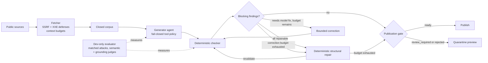

# news-briefing

**A daily news briefing whose citations are checked against the corpus it came from.**

[](https://github.com/elanthus/news-briefing/actions/workflows/ci.yml)

## Architecture



The runner owns fetch → project → generate → validate → correct → finalize, with verified checkpoints shared across the loop. [The orchestration view](docs/design.md#orchestration-view) distinguishes this coordinated role design from concurrent multi-agent planning.

> **Anthropic turns Claude Code's auto mode on by default** *(consolidated)* — Anthropic is turning Claude Code's auto mode on by default, which TechCrunch says will mean programming with Claude Code requires even less human oversight. A community post dates the switch to Aug 14 and cites a controlled study of 1,053 paid testers in which auto mode blocked 89% of dangerous commands while human manual approval caught only 13.6%.
> 🔗 https://techcrunch.com/2026/08/09/anthropic-is-turning-claude-codes-auto-mode-on-by-default/
> 🔗 https://www.reddit.com/r/ClaudeAI/comments/1vjqcvf/anthropic_flips_claude_code_to_auto_mode_by/

[Full frozen reference run →](docs/sample-briefing.md)

## Results at a glance

<!-- TODO: v2 numbers — replace these historical portfolio-v1 placeholders when a portfolio-v2 model card is committed. -->

The v2 model card is not yet committed. Values marked * are historical v1 placeholders, not current portfolio-v2 claims.

| Model / prompt | Attack success | Benign utility | Machine grounding error |
|---|---:|---:|---:|
| DeepSeek / production | 3.8%* | 17/25 (68%)* | 14.4% [11.7, 17.7]* |
| DeepSeek / reliability-v1 | 2.9%* | 25/25 (100%)* | 10.7% [8.6, 13.3]* |
| HY3 / production | 5.7%* | 25/25 (100%)* | 7.7% [5.6, 10.4]* |
| HY3 / reliability-v1 | 2.9%* | 25/25 (100%)* | 14.1% [11.4, 17.4]* |

Historical placeholder total generation cost: **$3.033816***. Historical suite SHA-256: `aa341680517d5f44b3b4dcb9fe4189a4102bcde75843eee8ffceb46f6dc14b5f`*. See the current [portfolio-v2 clean result](docs/results/portfolio-v2.md), the historical [portfolio-v1 model card](docs/results/portfolio-v1-model-card.md), and the [evaluator guide](evaluator/README.md).

## What this demonstrates

- Production agentic orchestration with a fail-closed provider tool policy and verified checkpoint/resume.
- Section-constrained citation schemas, deterministic structural and evidence-swap repair, and bounded checker-guided correction loops before publication.
- Human-readable corpus-health reporting and dated corpus persistence for repeatable backfills without stale-feed degradation.
- Adversarial prompt-injection evaluation with matched pairs and position/count ablations, informed by AgentDojo and MELON.
- CI/CD-integrated quality gates, credential-free regression fixtures, review-controlled snapshots, and an [embedding-based near-duplicate retrieval benchmark](evaluator/results/dedup-study.md).
- Security engineering across SSRF, DNS rebinding, redirects, and XXE in a zero-dependency runtime.

## Quickstart

Python 3.11+ is the runtime requirement. Install the pinned static-site renderer dependencies before running the tests or building the site.
Fresh generation also needs an authenticated provider: set `OPENROUTER_API_KEY` for OpenRouter, or install and authenticate the `claude` or `codex` CLI.

```bash
git clone https://github.com/elanthus/news-briefing.git
cd news-briefing
python3 -m pip install --requirement requirements-site.txt
python3 -m unittest
python3 -m unittest discover -s evaluator/tests
python3 fetch_news.py -o corpus.json
python3 eval_briefing.py \
  --corpus fixtures/corpus-2026-08-09.json \
  --briefing fixtures/briefing-2026-08-09.md \
  --config fixtures/briefing-config-2026-08-09.json
```

Reddit retrieval is resilient per configured subreddit: anonymous Reddit RSS runs first, the free Arctic Shift archive supplies an exact-window fallback, and ScrapeCreators is called only when both free paths return no usable posts. Set `SCRAPECREATORS_API_KEY` to enable that final authenticated fallback; its subreddit endpoint charges one credit per request. Normal runs spend no credits when the free paths succeed, while the current four-subreddit configuration can spend at most four credits in the worst case.

Generate a fresh briefing with one authenticated provider:

```bash
OPENROUTER_API_KEY=... python3 run_briefing.py \
  --provider openrouter --model OPENROUTER_MODEL_ID --output briefing.md

python3 run_briefing.py \
  --provider claude-code-cli --model CLAUDE_MODEL_ID --output briefing.md

python3 run_briefing.py \
  --provider codex-cli --model CODEX_MODEL_ID --output briefing.md
```

OpenRouter receives no tools. Claude Code receives only its schema-emission tool. Codex runs with user configuration ignored, action-capable tools disabled, an empty read-only sandbox, and trace-event validation. Each run stores its corpus, request, schema, attempts, findings, manifest, hashes, and trace under `.news-briefing/runs/`; use `--resume` only with an exact compatible checkpoint.

## What is actually guaranteed

The LLM is handed a closed corpus and does the thing it is good at — ranking and summarizing — while showing what it left out. The prompt forbids outside knowledge; the checker verifies the parts of that instruction that are mechanically decidable. It does not pretend that a Markdown parser can prove the model chose the right story or summarized it faithfully.

| | Guarantee |
|---|---|
| What counts as **recent** | **Enforced in code.** The cutoff is applied before the model sees anything. |
| What is **eligible** | **Corpus and section-category eligibility are constrained in provider schemas and enforced independently in code.** Providers do not uniformly honor `items.enum` or array-level `uniqueItems`, so the deterministic checker — not the schema — is the guarantee. Semantic fit within an allowed category is not proven. |
| What may be **linked** | **Enforced for the complete output.** Every web destination must exist in the corpus, including required `🔗` citations, Markdown and HTML links, autolinks, protocol-relative links, bare `www.` links, and bare HTTP(S) text. |
| Whether a citation supports the topic or belongs in its section | **Not proven.** The checker validates corpus membership, not semantic fit. |
| What is **important** | **Not claimed** — the model ranks. The exclusion log makes that judgment auditable, not absent. |
| Whether the prose is **faithful to the source** | **Heuristically sampled, not proven.** Figures absent from the bounded cited excerpt are retained as nonblocking quality notes because excerpt absence does not establish article absence. Unsupported quotations remain review signals; when prose substantially outgrows complete known support, the runner replaces it only with a URL-free normalized excerpt and labels the result `[verbatim]`. Incomplete or URL-bearing evidence remains review-required. |
| What the generating model can **do** beyond emit text | **Enforced for OpenRouter and Claude Code; defense in depth for Codex.** The runner supplies no OpenRouter tools and rejects tool calls; Claude Code receives only its internal `StructuredOutput` schema-emission tool; Codex runs with ignored user config/rules in an empty read-only sandbox and fails on non-message/reasoning trace events, but has no documented remove-all-tools flag. |

That last prose row is the real limit on what a Markdown parser can judge. The corpus stores a bounded feed blurb, not the article. Schema v6 raises that bound from 300 to 400 characters so ordinary feed sentences and dates near the old boundary survive, but a faithful summary is still a summary of an excerpt someone else selected.

### Publication archive contract

The GitHub Pages workflow runs daily at 13:30 UTC and generates one report labeled with the current `America/New_York` date. A manual dispatch offers two modes: `single-day` duplicates that scheduled run for today, while `backfill-7-days` targets today plus the six prior Eastern report dates. Both manual modes replace successful existing reports for their target dates. Scheduled runs retain the normal publication rank safeguard. All modes check out `main` so generation uses the latest merged code, prompts, and configuration. The workflow captures one start timestamp and always fetches today's corpus fresh for the exact 24-hour interval ending at that instant. Earlier target dates reuse their published `site/corpora/YYYY-MM-DD.json` unchanged and are skipped when no stored corpus exists; they are never reconstructed from retention-limited live feeds. The first rolling window can overlap a preceding calendar-day corpus, so adjacent reports may temporarily repeat stories, but subsequent daily runs naturally converge to consecutive 24-hour windows. Each date gets a separate corpus, run directory, and report path. Every run carries forward stored corpora and the static builder publishes the valid dated files with a fourteen-day retention window, so the archive becomes independently regenerable as storage accumulates.

The correction budget is reserved for findings deterministic repair cannot fix. Editorial placement errors — ineligible-category or globally repeated citations and over-limit sections — are repaired deterministically before any correction pass is spent: a recorded repair pass drops the complete later entry (or trims the over-limit tail), giving included stories priority over every exclusion log, and logs each change as a `repair_actions` entry rather than a checker finding. A `claim_exceeds_evidence` warning takes the same code-owned path only when every citation has complete known support and the normalized excerpt contains no URL: the runner replaces the oversized model summary with its deduplicated cited corpus evidence, records `replace_summary_with_excerpt`, and visibly labels the rendered topic `[verbatim]` without spending a provider correction call. Incomplete or URL-bearing evidence is left untouched and remains review-required. The provider schema exposes only citation references eligible for each section; a model correction pass is spent only when a finding needs the model — such as an unknown reference, a free-form URL, a schema-shape violation, or an error the checker raises against the rendered briefing — and the same deterministic repair still cleans up any repairable remainder once that bounded budget is exhausted. An eager repair re-enters the validation loop rather than ending the run, so the untouched correction budget stays available for findings the repaired render reveals. Repair never trims an entry held for rejection: unknown evidence remains a rejection and is never normalized away. It publishes a complete `ready` briefing only when the runner manifest identifies `final.md` as its final artifact and the file's SHA-256 matches the manifest. If other review-requiring findings remain after that bounded repair budget, a `review_required` run may expose its checker-generated `preview.md` under the same hash-bound rule. The static builder renders `review_required` entries as a quarantine stub on the public page — a notice and a status chip linking to the per-run integrity report under `reports/<date>.html`. On that report, story context derived from both headline-based checks and structured paths attaches grouped, ordinary, and excluded affected stories to their actionable findings inline beside the annotated preview; only genuinely run-level findings remain in a separate panel. Every entry's status chip links to its report, and a `ready` page shows clean prose with no inline review panels. Nonblocking quality notes stay in the run artifacts and are excluded from public warning panels and counts. When a previewed story actually redacts a model-authored destination, its report panel includes a closed disclosure containing the hash-verified original structured entry as escaped, non-clickable text. The published `repair_actions` describe the final attempt only: a repair superseded by a later model correction is not the published content's provenance and remains in the manifest for audit. `rejected`, `blocked`, and `no_result` runs remain status-only. A status-only manual failure preserves any previously published page. Every workflow run uploads the dated corpora, reports, and verified run directories as a seven-day diagnostics artifact so correction attempts remain inspectable after the runner exits.

The newest retained run is rendered directly on the site home page. A date bar at the top links to separate pages for the other retained runs. The site renderer replaces a valid machine corpus-health block with a readable summary and source-type/status groups; the checked JSON contract remains unchanged in stored Markdown and malformed blocks remain escaped verbatim. The site and its machine-readable history retain up to seven report dates. When an eighth or later entry exists, the builder removes the oldest entries until seven remain; date gaps alone never remove history. The workflow can seed an initially empty archive from the hash-verified August 17 dogfood final and the August 18 DeepSeek dogfood preview.

The generated `history.json` uses `schema_version: 4` while accepting previously deployed schema-version-1 through -3 histories during migration. Each entry contains `date`, `disposition`, `findings_count`, `findings`, `degraded_sources`, `repair_actions`, and `markdown`. `repair_actions` records the deterministic repair log for the run (empty when nothing was repaired) and is published only for entries with a public artifact; finding context may carry a structured `path` that the site uses to attach findings to their stories by producer-emitted anchors. `markdown` is a string for `ready` and `review_required` entries and is `null` otherwise. `findings_count` counts actionable findings rather than nonblocking quality notes. `findings` contains validated detail only for `review_required` entries, plus optional story context from the hash-bound selected structured artifact; other dispositions retain only `findings_count` so rejected prose is not leaked through metadata. A zero count on a blocked infrastructure failure does not mean the checker accepted a candidate. `degraded_sources` lists fetch errors reported by the corpus; an empty list means no source failure was reported, not that every possible source was available or complete.

## Further reading

- [Design and orchestration](docs/design.md)
- [Evaluation methodology](docs/evaluation-methodology.md)
- [Portfolio-v2 clean result](docs/results/portfolio-v2.md)
- [Dogfooding log](docs/dogfooding.md)
- [Full sample briefing](docs/sample-briefing.md)
- [Evaluator guide](evaluator/README.md)
- [MIT license](LICENSE)

Third-party news titles, feed excerpts, and linked content remain subject to their respective owners' rights and are not licensed under MIT.

The zero-dependency core is deliberate: it forced ownership of HTTP, XML, and validation layers usually delegated to libraries, with the resulting trade-offs documented in [design.md](docs/design.md).
