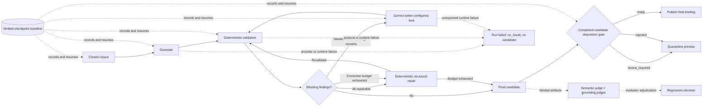

# Design notes

Why each stage of the pipeline works the way it does. The [README](../README.md) covers what the system guarantees; this covers the decisions behind those guarantees.

## Fetching

**Bounded, source-diverse context.** Broad technology feeds are filtered for AI relevance, tracking URLs are canonicalized before deduplication, and per-source and per-category caps stop one noisy publisher consuming the model's context window. Item counts alone are not a size bound, so schema v5 also caps each model-visible string, each configured source's serialized items, and the retained item set globally in both bytes and estimated tokens. Titles and summaries truncate on Unicode boundaries; URLs are dropped rather than rewritten. `processing`, per-source usage, and `context_budget` make every truncation and field/source/global drop observable.

**Every dropped item is accounted for.** `processing` reports `fetched`, `undated_dropped`, relevance/duplicate/cap drops, field/source/global budget drops, truncation counts, retained bytes/tokens, and `kept` per category. The drops after date parsing plus `kept` reconcile to `fetched`; `undated_dropped` is counted separately before `fetched` is measured. That separate count catches a feed silently changing its date format — those items never reach the other counters, so without it a dead source looks identical to a quiet one.

**Every source fetch is observable.** `sources` records exact source type and ID, whether a request was attempted and reached HTTP success, recognized, dated, and finally retained entry/byte/token-estimate counts, status, typed error details, and wall-clock latency for every configured request; `fetch_duration_ms` records the whole retrieval phase. Valid XML with an unexpected layout and responses with no parseable dates are explicit `empty` outcomes. `errors` contains structured projections of every `empty` or `error` source.

**Public network destinations only.** Source URLs are syntax-checked before scheduling: only HTTP(S), without credentials, is accepted. For each request, the hostname is resolved exactly once; every answer must be globally routable, and the socket connects directly to one of those captured addresses while TLS still authenticates the original hostname. Redirects are handled manually and repeat the complete URL, DNS, address-scope, and pinning process at every hop. That closes direct, redirect, and DNS-rebinding paths to loopback, private, link-local, and metadata-service addresses without a third-party HTTP dependency.

**Relevance filtering removes noise, not importance.** Only the known-broad feeds listed in `SOURCE_RELEVANCE_FILTERS` are keyword-filtered; category-specific and community sources pass through untouched. Over-filtering is the more expensive mistake, because an item dropped at this stage cannot be ranked at all and a starved sub-category cannot fill its reserved slots.

**Recency is the only sort order.** Recency is the one ordering that means the same thing across RSS, Hacker News, and Reddit; engagement scores are not available for every source. Timestamps are required to include a time and UTC offset, and sorting compares the represented instants rather than their differently offset ISO spellings. HN points may admit an item during fetching, but recency determines corpus order. Points and comment counts remain in the raw corpus for audit and are removed from the model projection because these mutable snapshots can be stale by reading time.

**Untrusted XML is parsed defensively.** Feeds are remote and unauthenticated, and `xml.etree` expands internal entities, so a compact payload can amplify far beyond the response-size bound. Before building the tree, an Expat declaration callback rejects every `DOCTYPE` after the parser has recognized the document encoding; it does not scan raw bytes or special-case UTF-16. The supported RSS/Atom subset does not need a DTD, and a rejection surfaces in `errors` like any other source failure. This closes entity-declaration and external-entity paths without depending on `defusedxml`, preserving the project’s zero-dependency runtime.

**Reddit's coarse buckets.** Reddit's `top` RSS endpoint accepts only `hour`/`day`/`week`/… buckets, not an arbitrary window. `fetch_news.py` picks the smallest bucket that fully covers `--hours`, then applies the exact cutoff in code, requesting proportionally more posts when the bucket overshoots so in-window coverage stays roughly constant. Reddit also rate-limits anonymous clients aggressively, so requests use a shorter timeout and a bounded two-attempt retry budget that honors `Retry-After`. A failed subreddit degrades coverage and appears in corpus health rather than holding the run open. Expect HTTP 429s: they are the normal case for anonymous access, not a misconfiguration.

## The corpus contract

[`corpus_schema.py`](../corpus_schema.py) is the single source of truth for the shape of `corpus.json` — field names, valid category shape, per-category processing consistency, counter semantics, and schema generations. Current producers write a positive integer `schema_version`; its absence is reserved for readable generation-0 historical corpora, while a malformed present declaration is invalid rather than legacy. The fetcher writes that shape, the prompt names fields a model may read, and the checker validates a briefing against the same data. Keeping those expectations in one validated contract makes incompatible producer changes fail at their source.

The fetcher validates against the contract before writing, so drift fails where it is introduced. `eval_briefing.py` validates a readable corpus before trusting its categories, items, timestamps, processing counters, errors, or source health, and refuses a corpus newer than it understands rather than misreading it.

Schema v4 replaces ambiguous error strings with structured identities and adds complete request outcomes. Schema v5 adds field/source/global context limits, per-source retained usage, and aggregate truncation/drop telemetry. Schema v6 expands the summary ceiling from 300 to 400 characters so a typical feed sentence or date near the former boundary is not cut off. It enforces those limits alongside item value types, absolute HTTP(S) URLs, timezone-aware full timestamps, and `cutoff <= published <= generated_at` rather than checking required keys alone.

**URL comparison lives here too.** `canonicalize_url` is part of the contract rather than the fetcher because two modules must agree on it: the fetcher deduplicates with it, and the checker decides whether a citation is in the corpus with it. A shared implementation ensures cosmetic changes such as a trailing slash cannot identify one article during deduplication and a different article during citation checking.

`url_route` splits a canonical URL into a location (scheme, host, path) and its query parameters, and the name is a warning: a location is not an article identity. Query-routed publishers put many articles under one path, so `news.ycombinator.com/item` addresses every Hacker News story there is. The checker only calls a failed citation a rewrite when a corpus URL at the same location carries a strict superset of its parameters, and only when exactly one does. Changing `item?id=123` to `item?id=999` therefore remains an ungrounded citation rather than being misreported as a cosmetic rewrite.

## The code-owned runner

[`run_briefing.py`](../run_briefing.py) is an orchestration boundary rather than another agent prompt. It owns the sequence fetch → project → generate → validate → correct → finalize, while provider adapters implement one `ModelProvider` protocol. The primary workflow remains Python-standard-library-only: OpenRouter uses `urllib`, and the Claude Code and Codex adapters launch their installed commands directly.

**The model never receives a destination, internal item ID, or mutable HN engagement.** Before generation, the runner projects each corpus item into untrusted evidence plus exactly one `citation_NNNN` handle. Handle numbering is item-aligned: an HN article with a separate discussion URL still consumes one handle, and both URLs live together in the code-owned citation map. HN points and comment counts remain only in the raw corpus. The runner asserts that the number and order of model-visible handles match the retained items, and each section's structured-output schema enumerates only its eligible citation IDs. Free-form output fields containing a web destination or opaque `citation_NNNN`/`item_NNNN` token fail validation. Rendering expands each selected item to all of its distinct code-owned destinations, so an HN article automatically carries its discussion link and a self-post is emitted only once. This reduces URL grounding from “check model-authored destinations after the fact” to “the model cannot author or omit a deterministic companion destination,” while the existing complete-output checker remains an independent backstop for hand-authored Markdown.

**Schema sampling and domain validation are separate.** All three providers receive the same strict JSON Schema: objects, required fields, arrays, scalar types, section-specific citation enums, `additionalProperties: false`, and the declared string and array bounds. The runner independently validates those bounds plus uniqueness, citation placement, cross-section deduplication, and free-form URL rules, so provider acceptance is never treated as proof of the application contract.

Not every provider honors `items.enum` or array-level `uniqueItems`, so the schema constrains cooperative samplers while the deterministic checker remains the guarantee.

A code-owned repair removes a complete entry if any of its evidence is ineligible or already used, and trims sections that exceed their configured maximum; it never leaves prose behind after removing that prose's evidence, and it never trims an entry preserved for rejection — with unknown evidence or a malformed shape in the over-limit tail, the limit finding persists and the run stays quarantined.

This repair runs eagerly — before any model correction — whenever every blocking finding is repairable, so an editorial placement error never spends correction budget; the repaired attempt then re-enters the validation loop, keeping the untouched budget available for findings the repaired render reveals.

A WARN-only `claim_exceeds_evidence` candidate also enters deterministic repair: its model summary is replaced by the same deduplicated cited evidence join the checker measured, then revalidated without spending a provider correction. The action is recorded as `replace_summary_with_excerpt`, and the producer emits `[verbatim]` (after any consolidated marker) so readers can distinguish corpus text from model prose. The same repair also runs as the post-budget fallback for any repairable remainder.

Included stories are considered before all exclusions, and every repair action is preserved in the manifest as `repair_actions`. Publication copies only the final attempt's repair actions: a repair superseded by a later model correction did not produce the published content, so it stays in the manifest as audit trail rather than public provenance. Unknown evidence remains a rejection rather than being normalized away.

Anthropic documents the same general pattern—validate generated values against application rules in code—in its [structured output guidance](https://platform.claude.com/docs/en/build-with-claude/structured-outputs); OpenAI likewise documents strict-schema support and keyword limits in its [structured output guide](https://developers.openai.com/api/docs/guides/structured-outputs).

**Operational completion is not a correctness verdict.** The checkpoint manifest retains `running`, `complete`, and `failed` for lifecycle control, while the result separately records publication disposition (`ready`, `review_required`, `rejected`, or `no_result`) plus protocol, contract, evidence, and coverage axes. A category-placement or exclusion-field error can leave a useful, corpus-bound candidate that needs review; an unknown citation or free-form destination is rejected. Source failures degrade coverage without making the model result a failure. Heuristic quotation findings require review rather than claiming semantic falsity; evidence-length findings are repaired only when the code can substitute the entry's complete known support, while figure findings remain nonblocking quality notes. Only `ready` writes `final.md` and the configured output path.

**Blocked candidates are preserved but quarantined.** When structured output exists but cannot pass the publication gate, the runner writes `preview.md` and a destination-redacted `preview-structured.json`. The preview renderer accepts malformed shapes defensively, substitutes only code-owned URLs for known citation references, omits unknown references, and redacts model-authored destinations from prose, finding details, values, and dictionary keys. It never writes the configured output path. For a `review_required` page, the publication step copies the affected entry from the hash-bound selected structured artifact into finding metadata and records any deterministic repair actions.

The public site renders `review_required` entries as a quarantine stub: a single notice paragraph, a status chip linking to the integrity report, and no briefing prose. Findings, repair actions, corpus health, and the annotated preview appear only on the per-run integrity report page under `reports/<date>.html`. There, headline-based semantic findings and path-based structured findings both resolve to ordinary, grouped, or excluded story entries and render inline beside their stories; only findings with no story context use the run-level panel. When a previewed story contains a destination-redaction marker, the report exposes the original inside a closed disclosure as HTML-escaped preformatted text: destinations remain visible for review but cannot become links or markup. The report's all-clear text appears only for a `ready` run with zero actionable findings — a blocked run's zero count never reads as acceptance. Each published entry carries a status chip linking to its report; `ready` entries show clean markdown without inline review panels.

**The tool policy is provider-specific but fail-closed.** OpenRouter receives no tool definitions and any returned tool call fails. Claude Code starts in safe mode, disables commands and session persistence, and uses both `--tools StructuredOutput` and `--allowedTools StructuredOutput` so its internal schema-emission tool is the only tool exposed or permitted; filesystem, shell, web, and MCP tools remain unavailable. The Codex adapter ignores user config and rules and explicitly disables shell, multi-agent, remote-plugin, web-search, and image tools while preserving medium reasoning. It also starts in an empty temporary directory with a read-only sandbox and rejects every completed trace item other than reasoning or the final agent message. Codex has no single documented remove-all-tools flag, so the sandbox and trace validator remain defense-in-depth backstops.

**Retries are transport policy, not creative iteration.** A provider call gets at most three attempts inside one total deadline, and only explicit, safely repeatable transient failures—rate limits, connection failures, and server failures—qualify. The runner honors `Retry-After`. OpenRouter and CLI timeouts may occur after transmission or billing, so they are never retried without an idempotency guarantee. CLI output and an interrupted in-flight checkpoint are ambiguous for the same reason. Content errors instead enter the separately bounded correction loop, one pass by default.

**Checkpoints are verified state, not just cached files.** The manifest binds the run to content hashes for trusted config, source config, generation policy, runner source files, every provider generation control, provider/CLI version, Python version, runner settings, and every recorded artifact. Writes are atomic; trace entries are appended and synced. Resume requires a still-running compatible manifest and matching hashes, and reads the corpus only from the exact bytes whose recorded hash was verified. It reuses a received or validated response, but refuses an in-flight call and any changed input, runtime, control, or artifact.

## Orchestration view

The system is a coordinated multi-role loop: a generator agent works from a closed corpus under a fail-closed provider tool policy; a deterministic checker acts as the oracle; a deterministic normalizer repairs editorial placement and evidence-length errors; and a bounded corrector gets up to the configured repair limit (one checker-guided pass by default) for findings repair cannot fix. When every blocking finding is repairable — an ineligible-category or globally repeated citation, or an over-limit section — the normalizer runs first and no correction pass is spent; a WARN-only oversized summary likewise takes the evidence-swap path before finalization.

The correction budget is reserved for findings that need the model, such as unknown references, free-form URLs, or schema-shape violations. The same normalizer also runs as the post-budget fallback, removing any unsafe later entries that survive correction, before the code-owned disposition gate decides whether the result can be published.

In production, an outer fail-closed chain runs that complete protocol independently with Hy3, DeepSeek V4 Flash 0731, and Gemini 3.7 Flash until one result is `ready`. Hy3 and DeepSeek each allow up to 100,000 completion tokens; Gemini is capped at its supported maximum of 65,536. Failed candidates remain in isolated run directories, and the chain records their reason, quarantined report path, and OpenRouter model-removal state before advancing. Because a generation 404 can also mean no endpoint satisfies the required parameters, removal is confirmed against the public model catalog and remains unknown when that check fails. Publication resolves only the selected successful child run.

In the evaluator, separate semantic and grounding judges perform blinded machine review for adjudication and regression decisions. Those evaluation judgments measure the loop, while the completed-candidate gate remains deterministic and records `ready`, `review_required`, or `rejected`; an outer protocol or runtime failure instead records `no_result` without a candidate.



This is orchestration of specialized roles around one generator, not concurrent multi-agent planning. Where a property is checkable—schema shape, citation membership, section limits, duplicate placement, or corpus-health reporting—a deterministic oracle is cheaper, reproducible, and more reliable than asking a second LLM. Model judges are reserved for semantic properties that code cannot honestly settle, and their machine-review status remains explicit.

## Ranking and checking

**Configured slot allocation.** The default reserves space for each section so high-volume AI industry news cannot crowd out dev tools and practices. A different mix can reserve that space differently without changing code.

**Claim grounding is sampled, not asserted.** Verifying that prose is entailed by its source needs a semantic judge, so the deterministic checker does not pretend to settle it. Quotation and length checks remain WARN signals; in the production runner, a length warning with complete known evidence is repaired by substituting that evidence, while an unsafe or incomplete boundary is preserved for review.

Figure checks are nonblocking quality notes: the corpus contains bounded feed excerpts, so a number's absence from an excerpt cannot establish its absence from the linked article.

A figure missing from the cited excerpts is still cross-checked against item-level corpus evidence: when the exact figure appears in an uncited item with at least three shared title terms and 60% overlap with the shorter title, the checker emits `figure_supported_elsewhere`; otherwise it emits `unsupported_figure`. Both remain available in evaluation and run artifacts, but neither blocks ordinary publication nor appears in public review-required panels. The conservative title threshold prevents a common number elsewhere in a large corpus from being presented as corroboration for an unrelated claim. The committed reference pair evaluates clean under those heuristics, but that result does not establish semantic entailment; run the checker and review the evidence for each new output.

**Exclusion accountability.** The default asks for the next five stories dropped from each accountable section, with a reason; the configuration can change that target or exempt a section with `0`. The log heading itself is required only while at least one section is still accountable, so a configuration that exempts every section is not asked for an empty one. Silent omission is the failure mode you cannot otherwise detect.

**Corpus health reporting.** Fetch failures, silent empty outcomes, and items dropped because their dates could not be parsed are collected per source and surfaced in the briefing, so a degraded run looks degraded instead of just looking short. For v4 and newer corpora, the checker requires one fenced JSON manifest whose failed-source identities and statuses exactly match the structured error records and whose undated-source identities and counts match `parsed_entries - dated_entries`. Category-level `undated_dropped` totals must reconcile with those per-source counts. Prose-only claims, paraphrased IDs, duplicate entries, omitted degradation, and invented degradation are errors. The static site transforms a valid checked block at render time into readable counts and groups by source type and status; stored Markdown retains the machine contract, and malformed JSON remains escaped verbatim. Older frozen corpora retain their legacy text check solely for reproducible historical fixtures.

**Private stored corpora make historical backfill deterministic.** Each workflow run restores the newest authenticated encrypted corpus artifact, prunes it to fourteen report dates, captures one instant, fetches today's corpus fresh for the exact preceding 24 hours ending at that instant, and labels it with the current `America/New_York` date. Backfill reuses those exact private corpora unchanged for the six prior target dates and warns and skips when one is missing; it never reconstructs a historical date from retention-limited live feeds. The one-time legacy migration stages and validates all thirteen retained Pages corpora before accepting any, while a text-free Pages marker distinguishes a completed migration from a new installation. After migration, an archive-retention gap starts a new private window and still fetches today rather than retrying removed legacy URLs forever. The restore step narrowly scopes the GitHub token and archive passphrase; neither reaches feed parsing nor model execution. The initial rolling window may overlap the preceding calendar-day corpus, and independently captured end times can create small overlaps or gaps between later windows. The site builder receives the private files only as local build inputs and emits text-free manifests under `site/manifests/`: item IDs, category, source, timestamp, canonical destinations, and SHA-256 hashes of the exact title and excerpt bytes. It removes stale `site/corpora` output and never copies raw source text into Pages.

**Untrusted-data boundary.** The generation policy treats all public-feed text as untrusted content and forbids following instructions embedded in it. The runner gives OpenRouter no tools and gives Claude Code only its non-action-capable `StructuredOutput` schema-emission tool, with the documented Codex limitation above. Citation projection prevents the model from authoring link destinations, and complete-output grounding independently allowlists every rendered web destination, whether represented as a required `🔗` citation, Markdown link, HTML link, autolink, protocol-relative link, bare `www.` link, or bare HTTP(S) text. Raw URLs and HTML-decoded candidates are checked separately so entity-encoded schemes cannot bypass validation without changing legitimate query parameters. See the [evaluation threat model](evaluation-methodology.md#scope-and-threat-model) for the selection and prose channels that remain open.

## Regression-testing a prompt change

[`fixtures/`](../fixtures) holds a frozen corpus, briefing, and briefing configuration. To check whether an edit to `briefing-prompt.md` made things worse, run the agent against the frozen corpus and configuration, then check the output against the same frozen inputs:

```bash
python3 eval_briefing.py \
  --corpus fixtures/corpus-2026-08-09.json \
  --briefing your-new-output.md \
  --config fixtures/briefing-config-2026-08-09.json
```

Diff it against [`fixtures/briefing-2026-08-09.md`](../fixtures/briefing-2026-08-09.md). The frozen inputs make this a controlled comparison, so any difference is attributable to the prompt.

The reference briefing is a **regression baseline, not a golden answer**. Ranking is judgment, and a prompt change that reorders two topics is not automatically a regression. What the baseline catches is the silent structural stuff: a dropped exclusion log, a collapsed sub-category, links drifting away from the corpus.

For behavior rather than parser regression, the development-only [`evaluator/`](../evaluator/) runs a committed utility, quality, and attack set through Codex CLI, Claude Code CLI, OpenRouter, or NVIDIA. It preserves both model attempts, structured checker findings before and after correction, attack-oracle outcomes, model settings, timestamps, content hashes, and Git provenance. The deterministic gold-label suite is separate from live generation so parser failures, semantic checker limits, and stochastic model behavior keep honest denominators; its label provenance distinguishes model review, owner adjudication, and incomplete independent human review.

## References and influences

- Elham Tabassi, [*Artificial Intelligence Risk Management Framework (AI RMF 1.0)*](https://doi.org/10.6028/NIST.AI.100-1), NIST AI 100-1 (2023), especially the [MEASURE function](https://airc.nist.gov/airmf-resources/airmf/5-sec-core/). It motivates documented and repeatable test, evaluation, verification, and validation; deployment-representative measurement; independent assessment; explicit uncertainty; and monitoring risks over time.
- Frank Coyle, [“Why Agentic Systems Need Ontologies”](https://www.youtube.com/watch?v=Sir59K8ZDPU&t=8s), AI Engineer World's Fair (2026). The relevant architectural principle is probabilistic reasoning inside deterministic domain validation. This repository realizes that principle with closed-world corpus schemas and purpose-built checks rather than an RDF/OWL ontology.
